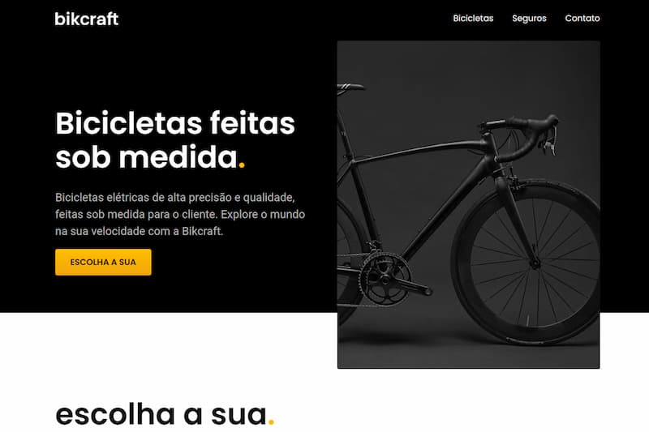
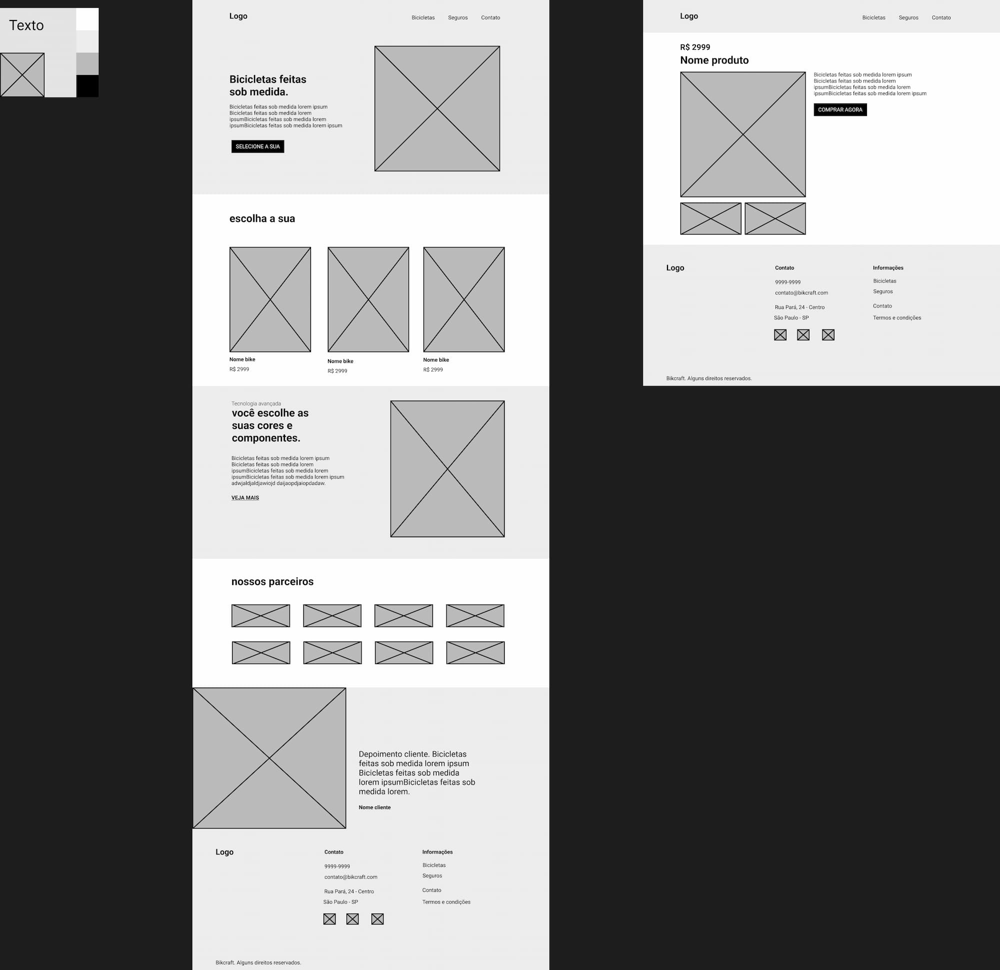
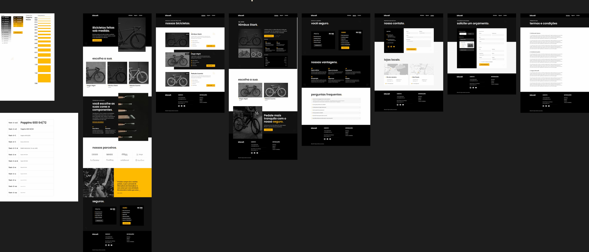

# 🚲 Bikcraft

Este é o projeto Bikcraft, desenvolvido como parte do curso da [Origamid](https://www.origamid.com/). O objetivo deste projeto é criar um site fictício para a venda de bicicletas elétricas personalizadas e feitas sob medida para o cliente. O site foi desenvolvido utilizando HTML, CSS e JavaScript.

# 📋 Visão Geral

O Bikcraft é um site fictício que visa oferecer bicicletas elétricas de alta precisão e qualidade personalizadas.
Alguns conceitos desenvolvidos durante o projeto:
- O que é Design, UI Design e UX Design;
- Espaços, cores e tipografia;
- Wireframe e prototipagem com Figma;
- HTML, CSS e JavaScript básico;
- Responsividade.

# 💻 Tecnologias Utilizadas

- HTML: A estrutura do ite será criada com HTML semântico para garantir acesibilidade adequada. Utilizando tags como: header, nav, main, footer, article e section, além de atributos como aria-label.
- CSS: Os estilos e layout do site serão implementados com CSS puro.
- JavaScript: Alguns recursos interativos e animações foram adicionados usando JS. Foi utilizado apenas um plugin externo para algumas animações, da própria Origamid, disponível em: [Simple Anime](https://github.com/origamid/simple-anime).
- Figma: O Figma foi utilizado para fazer os wireframes e os protótipos do site. Além de definir um Design System para manter a consistência de tipografia, cores e espaçamento do site.

# 📝 Wireframe e Prototipagem

Wireframe

Protótipo

